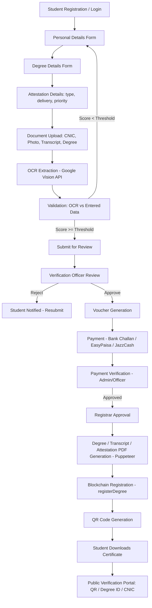

# Blockchain-Based Degree Attestation System — Project Overview

## 1. Purpose

A paperless, end-to-end Degree Attestation platform modeled on HEC's (Higher Education Commission) attestation workflow. Students apply online, upload documents, get them OCR-extracted and validated, pay fees, and receive a digitally signed, blockchain-anchored degree/transcript with a QR code that any employer or third party can verify instantly.

## 2. Technology Stack

| Layer | Technology |
|---|---|
| Frontend | Next.js 15 (App Router), TypeScript, Tailwind CSS, Shadcn UI, React Hook Form, Zod, TanStack Query |
| Backend | NestJS, TypeScript, Prisma ORM, JWT Auth, Swagger |
| Database | PostgreSQL |
| OCR | Google Cloud Vision API |
| Blockchain | Solidity, Hardhat, Polygon Amoy Testnet |
| File Storage | Cloudinary |
| PDF Generation | Puppeteer |
| QR Generation | `qrcode` npm package |
| Hashing | SHA-256 (Node `crypto`) |

## 3. User Roles

| Role | Key Capabilities |
|---|---|
| **Student** | Register/login, submit application, upload documents, track status, download certificates |
| **Verification Officer** | Review applications, verify OCR vs entered data, approve/reject documents |
| **Registrar** | Final approval, generate certificates, trigger blockchain registration |
| **Admin** | User management, application oversight, officer management, reports, audit logs |
| **External Verifier** | Public — verify via QR / Degree ID / CNIC, no login required |

## 4. End-to-End Workflow

## 5. Module Map

1. Authentication & RBAC
2. Personal Details
3. Degree Details
4. Attestation Request
5. Document Upload (Cloudinary)
6. OCR Extraction (Google Vision)
7. Data Validation (OCR vs manual entry)
8. Voucher Generation
9. Payment Processing & Verification
10. Degree/Transcript/Certificate Generation (Puppeteer)
11. Blockchain Registration (Solidity + Hardhat + Polygon Amoy)
12. QR Code Generation & Verification
13. Public Verification Portal
14. Audit Log

## 6. Document Index

- [01-architecture.md](01-architecture.md) — System architecture, deployment, security, RBAC
- [02-database-erd-prisma.md](02-database-erd-prisma.md) — ERD + full Prisma schema
- [03-backend-nestjs.md](03-backend-nestjs.md) — NestJS structure, REST API, DTOs
- [04-frontend-nextjs.md](04-frontend-nextjs.md) — Next.js structure & key pages
- [05-blockchain.md](05-blockchain.md) — Smart contract, Hardhat, deployment
- [06-ocr-validation.md](06-ocr-validation.md) — OCR architecture & validation logic
- [07-modules-detail.md](07-modules-detail.md) — Voucher, Payment, Degree Gen, QR, Verification Portal, Audit Log
- [08-diagrams.md](08-diagrams.md) — Sequence, Use Case, Class, Activity diagrams
- [09-roadmap-and-presentation.md](09-roadmap-and-presentation.md) — Roadmap, sprint plan, presentation structure
