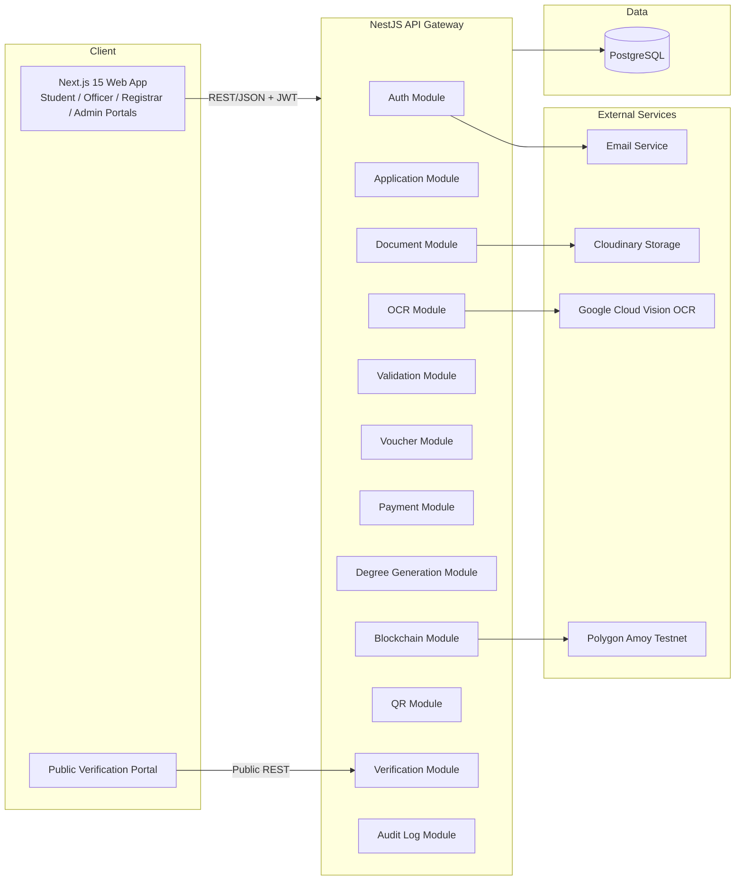
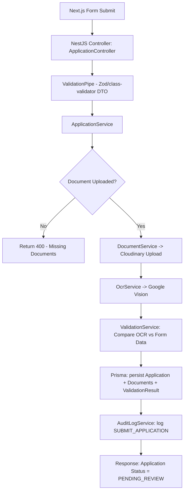
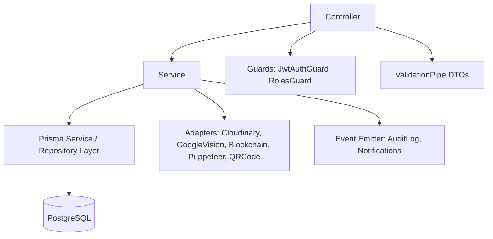
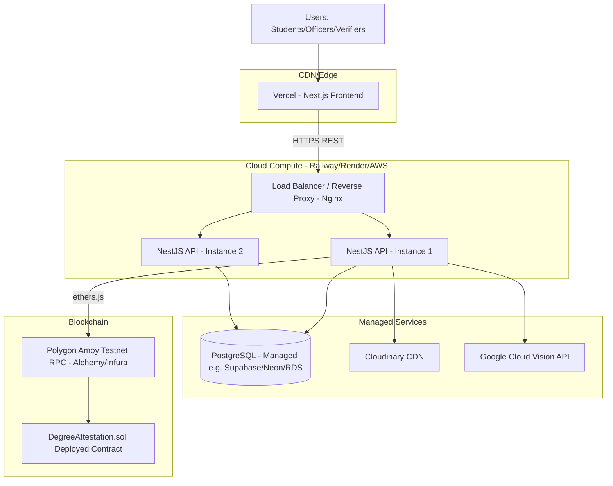
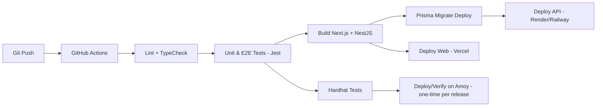
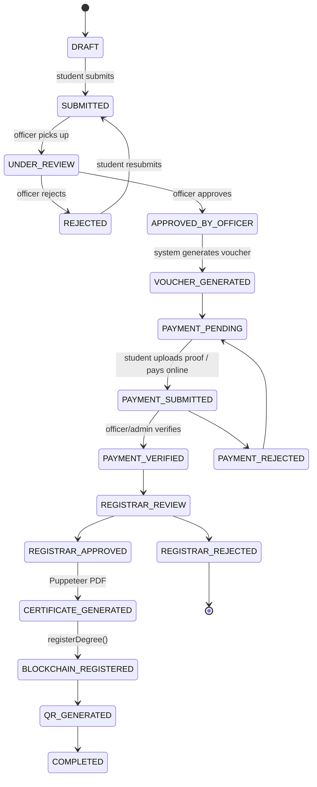

# System Architecture, Deployment, Security & RBAC

## 1. High-Level Architecture



## 2. Low-Level Architecture (Request Lifecycle Example: Submit Degree for Attestation)



## 3. Layered Backend Architecture (NestJS)



## 4. Deployment Architecture



### Environments

| Env | Purpose | Notes |
|---|---|---|
| `development` | Local dev | Local Postgres (Docker), Hardhat local node, Cloudinary sandbox |
| `staging` | Pre-prod testing | Polygon Amoy testnet, managed Postgres |
| `production` | Live demo / submission | Polygon Amoy (mainnet not required for academic project) |

### CI/CD (Conceptual)



## 5. Security Design

### 5.1 Authentication & Session Security
- **JWT Access Token** (short-lived, 15 min) + **Refresh Token** (httpOnly secure cookie, 7 days, rotated on use).
- Passwords hashed with **bcrypt** (cost factor 12).
- Email verification via signed token (JWT or random token + expiry) sent through SMTP.
- Password reset via single-use, time-limited token (15 min expiry).

### 5.2 Transport & Storage Security
- HTTPS enforced everywhere (HSTS).
- All file uploads validated for MIME type, extension, and size (max 5MB) before Cloudinary upload.
- Cloudinary uploads use **signed upload presets** — signature generated server-side, never expose API secret to client.
- CNIC numbers and sensitive PII encrypted at rest using application-level AES-256-GCM (Prisma middleware) for `cnic`, `cnicFront`/`cnicBack` references.

### 5.3 API Security
- **Helmet** for HTTP headers.
- **Rate limiting** (`@nestjs/throttler`) — especially on auth, OCR, and verification endpoints (prevent brute force / scraping).
- **CORS** restricted to known frontend origins.
- Input validation via `class-validator` + Zod (frontend mirrors backend schema).
- SQL injection prevented inherently via Prisma parameterized queries.
- File upload virus/type scanning (basic MIME sniffing via `file-type` package).

### 5.4 Blockchain Security
- Backend's blockchain signer wallet private key stored in secrets manager / `.env` (never committed).
- Only backend (Registrar-triggered, server-signed) can call `registerDegree()` and `revokeDegree()` — enforced via `onlyOwner`/`onlyRegistrar` modifier on the contract, where "owner" = backend's wallet address.
- `verifyDegree()` is a public `view` function — no gas cost, callable by anyone (including frontend via read-only RPC call).

### 5.5 Audit & Monitoring
- Every sensitive action (login, document upload, approval, rejection, blockchain registration, verification request) written to `AuditLog` table with actor, IP, timestamp, and metadata (see [07-modules-detail.md](07-modules-detail.md)).
- Centralized error logging (e.g., Sentry) for backend exceptions.

## 6. Role-Based Access Control (RBAC)

### 6.1 Roles Enum

```ts
enum Role {
  STUDENT
  VERIFICATION_OFFICER
  REGISTRAR
  ADMIN
}
```//note: External Verifier is unauthenticated/public, not part of Role enum

### 6.2 Permission Matrix

| Resource / Action | Student | Verification Officer | Registrar | Admin |
|---|---|---|---|---|
| Register / Login | ✅ | ✅ (created by Admin) | ✅ (created by Admin) | ✅ |
| Submit Application | ✅ (own) | ❌ | ❌ | ❌ |
| View Own Application | ✅ | ❌ | ❌ | ✅ |
| View All Applications | ❌ | ✅ | ✅ | ✅ |
| Review/Verify Documents | ❌ | ✅ | ✅ | ✅ |
| Approve/Reject Application | ❌ | ✅ (stage 1) | ✅ (final) | ✅ |
| Generate Voucher | system-triggered (post officer approval) | | | |
| Verify Payment | ❌ | ✅ | ✅ | ✅ |
| Generate Degree/Transcript PDF | ❌ | ❌ | ✅ | ✅ |
| Trigger Blockchain Registration | ❌ | ❌ | ✅ | ✅ |
| Manage Users / Officers | ❌ | ❌ | ❌ | ✅ |
| View Reports / Audit Logs | ❌ | partial (own actions) | partial | ✅ |
| Public Verification (QR/ID/CNIC) | ✅ (public, no auth) |

### 6.3 Guard Implementation Pattern (NestJS)

```ts
// roles.decorator.ts
export const Roles = (...roles: Role[]) => SetMetadata('roles', roles);

// roles.guard.ts
@Injectable()
export class RolesGuard implements CanActivate {
  constructor(private reflector: Reflector) {}
  canActivate(context: ExecutionContext): boolean {
    const requiredRoles = this.reflector.getAllAndOverride<Role[]>('roles', [
      context.getHandler(),
      context.getClass(),
    ]);
    if (!requiredRoles) return true;
    const { user } = context.switchToHttp().getRequest();
    return requiredRoles.includes(user.role);
  }
}

// usage
@UseGuards(JwtAuthGuard, RolesGuard)
@Roles(Role.REGISTRAR, Role.ADMIN)
@Post(':id/generate-degree')
generateDegree(@Param('id') id: string) { ... }
```

## 7. Application Status Lifecycle (State Machine)


