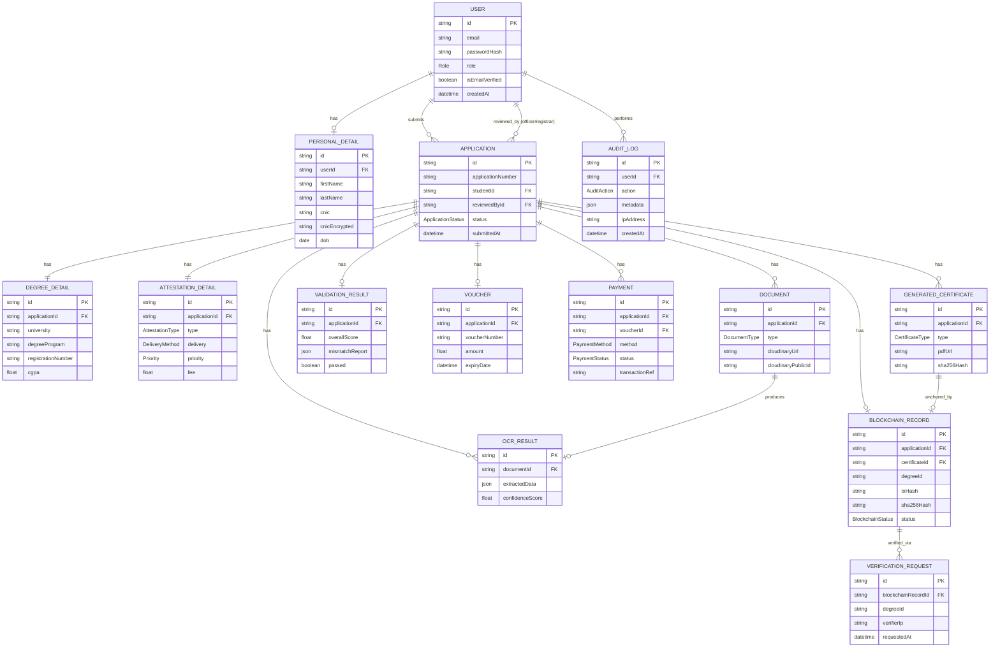

# Database ERD & Prisma Schema

## 1. Entity-Relationship Diagram



## 2. Full Prisma Schema (`schema.prisma`)

```prisma
generator client {
  provider = "prisma-client-js"
}

datasource db {
  provider = "postgresql"
  url      = env("DATABASE_URL")
}

// ============================
// ENUMS
// ============================

enum Role {
  STUDENT
  VERIFICATION_OFFICER
  REGISTRAR
  ADMIN
}

enum Gender {
  MALE
  FEMALE
  OTHER
}

enum MaritalStatus {
  SINGLE
  MARRIED
  DIVORCED
  WIDOWED
}

enum ApplicationStatus {
  DRAFT
  SUBMITTED
  UNDER_REVIEW
  REJECTED
  APPROVED_BY_OFFICER
  VOUCHER_GENERATED
  PAYMENT_PENDING
  PAYMENT_SUBMITTED
  PAYMENT_VERIFIED
  PAYMENT_REJECTED
  REGISTRAR_REVIEW
  REGISTRAR_REJECTED
  REGISTRAR_APPROVED
  CERTIFICATE_GENERATED
  BLOCKCHAIN_REGISTERED
  QR_GENERATED
  COMPLETED
}

enum AttestationType {
  DEGREE_ATTESTATION
  TRANSCRIPT_ATTESTATION
  DEGREE_GENERATION
  DUPLICATE_DEGREE
}

enum DeliveryMethod {
  DIGITAL
  PHYSICAL
}

enum Priority {
  NORMAL
  URGENT
}

enum DocumentType {
  CNIC_FRONT
  CNIC_BACK
  PHOTO
  TRANSCRIPT
  DEGREE
}

enum PaymentMethod {
  BANK_CHALLAN
  EASYPAISA
  JAZZCASH
}

enum PaymentStatus {
  PENDING
  APPROVED
  REJECTED
}

enum CertificateType {
  DEGREE
  TRANSCRIPT
  ATTESTATION_CERTIFICATE
}

enum BlockchainStatus {
  NOT_REGISTERED
  PENDING
  REGISTERED
  REVOKED
  FAILED
}

enum AuditAction {
  LOGIN
  LOGOUT
  REGISTER
  UPLOAD_DOCUMENT
  SUBMIT_APPLICATION
  APPROVE_APPLICATION
  REJECT_APPLICATION
  VERIFY_PAYMENT
  GENERATE_CERTIFICATE
  BLOCKCHAIN_REGISTER
  BLOCKCHAIN_REVOKE
  VERIFICATION_REQUEST
}

// ============================
// USER & AUTH
// ============================

model User {
  id               String   @id @default(uuid())
  email            String   @unique
  passwordHash     String
  role             Role     @default(STUDENT)
  isEmailVerified  Boolean  @default(false)
  emailVerifyToken String?
  resetToken       String?
  resetTokenExpiry DateTime?
  isActive         Boolean  @default(true)
  createdAt        DateTime @default(now())
  updatedAt        DateTime @updatedAt

  personalDetail   PersonalDetail?
  applications     Application[] @relation("StudentApplications")
  reviewedApps     Application[] @relation("ReviewedApplications")
  auditLogs        AuditLog[]

  @@map("users")
}

model PersonalDetail {
  id             String        @id @default(uuid())
  userId         String        @unique
  user           User          @relation(fields: [userId], references: [id], onDelete: Cascade)

  profilePicture String?
  title          String?       // Mr, Ms, Dr, Engr, etc.
  firstName      String
  middleName     String?
  lastName       String
  fatherName     String
  maritalStatus  MaritalStatus?
  gender         Gender
  dateOfBirth    DateTime
  address        String
  country        String
  city           String
  cnic           String        @unique   // masked in API responses
  cnicEncrypted  String?       // AES-256 encrypted full value

  createdAt      DateTime @default(now())
  updatedAt      DateTime @updatedAt

  @@map("personal_details")
}

// ============================
// APPLICATION (root entity)
// ============================

model Application {
  id                String            @id @default(uuid())
  applicationNumber String           @unique // e.g., DAS-2026-000123
  studentId         String
  student           User              @relation("StudentApplications", fields: [studentId], references: [id])

  reviewedById      String?
  reviewedBy        User?             @relation("ReviewedApplications", fields: [reviewedById], references: [id])

  status            ApplicationStatus @default(DRAFT)
  rejectionReason   String?

  submittedAt       DateTime?
  createdAt         DateTime          @default(now())
  updatedAt         DateTime          @updatedAt

  degreeDetail       DegreeDetail?
  attestationDetail  AttestationDetail?
  documents          Document[]
  validationResult   ValidationResult?
  voucher            Voucher?
  payments           Payment[]
  certificates       GeneratedCertificate[]
  blockchainRecord   BlockchainRecord?

  @@map("applications")
}

// ============================
// DEGREE DETAIL
// ============================

model DegreeDetail {
  id                 String      @id @default(uuid())
  applicationId      String      @unique
  application        Application @relation(fields: [applicationId], references: [id], onDelete: Cascade)

  university         String
  department         String
  degreeProgram      String
  passingYear        Int
  rollNumber         String
  registrationNumber String
  cgpa               Float

  createdAt          DateTime @default(now())
  updatedAt          DateTime @updatedAt

  @@map("degree_details")
}

// ============================
// ATTESTATION DETAIL
// ============================

model AttestationDetail {
  id            String           @id @default(uuid())
  applicationId String           @unique
  application   Application      @relation(fields: [applicationId], references: [id], onDelete: Cascade)

  type          AttestationType
  delivery      DeliveryMethod
  priority      Priority         @default(NORMAL)
  baseFee       Float
  urgentFee     Float            @default(0)
  deliveryFee   Float            @default(0)
  totalFee      Float

  createdAt     DateTime @default(now())
  updatedAt     DateTime @updatedAt

  @@map("attestation_details")
}

// ============================
// DOCUMENTS
// ============================

model Document {
  id                String       @id @default(uuid())
  applicationId     String
  application       Application  @relation(fields: [applicationId], references: [id], onDelete: Cascade)

  type              DocumentType
  fileName          String
  mimeType          String
  fileSizeBytes     Int
  cloudinaryUrl     String
  cloudinaryPublicId String

  ocrResult         OcrResult?

  uploadedAt        DateTime @default(now())

  @@map("documents")
}

// ============================
// OCR RESULT
// ============================

model OcrResult {
  id              String   @id @default(uuid())
  documentId      String   @unique
  document        Document @relation(fields: [documentId], references: [id], onDelete: Cascade)

  applicationId   String   // denormalized for easy querying
  extractedData   Json     // structured key-value extraction
  rawText         String?  @db.Text
  confidenceScore Float    // 0.0 - 1.0

  processedAt     DateTime @default(now())

  @@map("ocr_results")
}

// ============================
// VALIDATION RESULT
// ============================

model ValidationResult {
  id             String      @id @default(uuid())
  applicationId  String      @unique
  application    Application @relation(fields: [applicationId], references: [id], onDelete: Cascade)

  overallScore   Float       // 0-100
  passed         Boolean
  mismatchReport Json        // field-level diffs

  createdAt      DateTime @default(now())

  @@map("validation_results")
}

// ============================
// VOUCHER
// ============================

model Voucher {
  id              String      @id @default(uuid())
  applicationId   String      @unique
  application     Application @relation(fields: [applicationId], references: [id], onDelete: Cascade)

  voucherNumber   String      @unique
  requestNumber   String
  studentName     String
  serviceType     String
  amount          Float
  issueDate       DateTime    @default(now())
  expiryDate      DateTime
  pdfUrl          String?

  payments        Payment[]

  @@map("vouchers")
}

// ============================
// PAYMENT
// ============================

model Payment {
  id              String        @id @default(uuid())
  applicationId   String
  application     Application   @relation(fields: [applicationId], references: [id], onDelete: Cascade)

  voucherId       String
  voucher         Voucher       @relation(fields: [voucherId], references: [id])

  method          PaymentMethod
  status          PaymentStatus @default(PENDING)
  amount          Float
  transactionRef  String?       // bank ref / EasyPaisa TID / JazzCash TID
  proofUrl        String?       // uploaded challan/screenshot via Cloudinary

  verifiedById    String?
  verifiedAt      DateTime?
  rejectionReason String?

  createdAt       DateTime @default(now())
  updatedAt       DateTime @updatedAt

  @@map("payments")
}

// ============================
// GENERATED CERTIFICATES
// ============================

model GeneratedCertificate {
  id            String          @id @default(uuid())
  applicationId String
  application   Application     @relation(fields: [applicationId], references: [id], onDelete: Cascade)

  type          CertificateType
  pdfUrl        String
  cloudinaryPublicId String
  sha256Hash    String          @unique

  generatedAt   DateTime @default(now())

  blockchainRecord BlockchainRecord?

  @@map("generated_certificates")
}

// ============================
// BLOCKCHAIN RECORD
// ============================

model BlockchainRecord {
  id              String           @id @default(uuid())
  applicationId   String           @unique
  application     Application      @relation(fields: [applicationId], references: [id], onDelete: Cascade)

  certificateId   String           @unique
  certificate     GeneratedCertificate @relation(fields: [certificateId], references: [id])

  degreeId        String           @unique // human-readable on-chain ID, e.g. DAS-2026-000123
  studentIdHash   String           // hashed reference to student (privacy)
  sha256Hash      String
  txHash          String?
  blockNumber     Int?
  contractAddress String?
  status          BlockchainStatus @default(NOT_REGISTERED)

  registeredAt    DateTime?
  revokedAt       DateTime?

  qrCodeUrl       String?

  verificationRequests VerificationRequest[]

  @@map("blockchain_records")
}

// ============================
// VERIFICATION REQUEST (public portal logs)
// ============================

model VerificationRequest {
  id                  String   @id @default(uuid())
  blockchainRecordId  String?
  blockchainRecord    BlockchainRecord? @relation(fields: [blockchainRecordId], references: [id])

  degreeIdQueried     String
  method              String   // "DEGREE_ID" | "QR" | "CNIC"
  found               Boolean
  verifierIp          String?
  requestedAt         DateTime @default(now())

  @@map("verification_requests")
}

// ============================
// AUDIT LOG
// ============================

model AuditLog {
  id        String      @id @default(uuid())
  userId    String?
  user      User?       @relation(fields: [userId], references: [id])

  action    AuditAction
  metadata  Json?
  ipAddress String?
  userAgent String?

  createdAt DateTime @default(now())

  @@map("audit_logs")
  @@index([userId])
  @@index([action])
}
```

## 3. Indexing & Constraints Notes

- `applications.applicationNumber`, `vouchers.voucherNumber`, `blockchain_records.degreeId`, `generated_certificates.sha256Hash` — all unique, used as public lookup keys.
- `personal_details.cnic` unique — prevents duplicate registrations per CNIC.
- Composite indexes recommended: `Application(studentId, status)`, `Payment(applicationId, status)`, `AuditLog(userId, action, createdAt)`.
- `Json` fields (`extractedData`, `mismatchReport`, `metadata`) allow flexible schema evolution without migrations.

## 4. Sample SQL DDL Snippets (generated by Prisma Migrate)

```sql
CREATE TABLE "applications" (
  "id" UUID PRIMARY KEY DEFAULT gen_random_uuid(),
  "application_number" VARCHAR UNIQUE NOT NULL,
  "student_id" UUID NOT NULL REFERENCES "users"("id"),
  "reviewed_by_id" UUID REFERENCES "users"("id"),
  "status" VARCHAR NOT NULL DEFAULT 'DRAFT',
  "rejection_reason" TEXT,
  "submitted_at" TIMESTAMP,
  "created_at" TIMESTAMP NOT NULL DEFAULT now(),
  "updated_at" TIMESTAMP NOT NULL DEFAULT now()
);

CREATE INDEX idx_applications_student_status ON applications(student_id, status);
```
