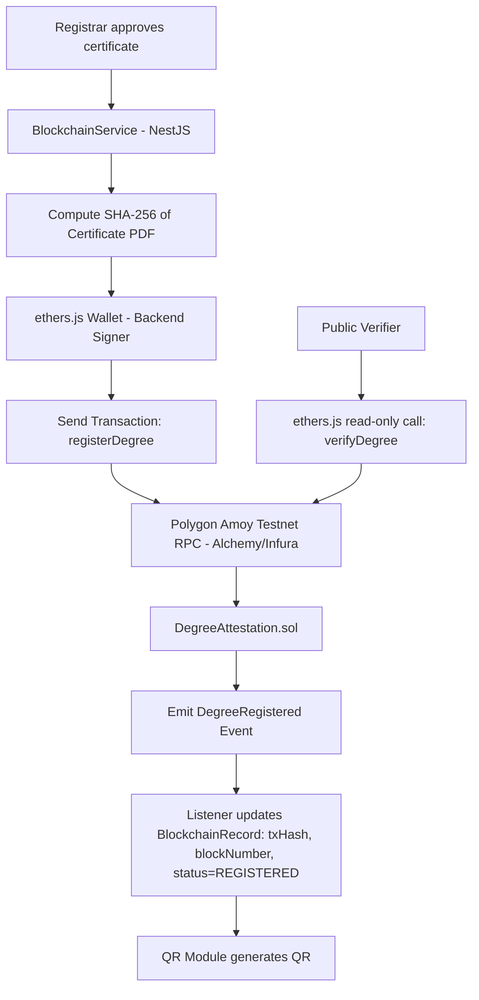

# Blockchain Module — Smart Contract, Hardhat & Polygon Amoy Integration

## 1. Blockchain Architecture



## 2. Smart Contract — `DegreeAttestation.sol`

```solidity
// SPDX-License-Identifier: MIT
pragma solidity ^0.8.24;

/// @title Degree Attestation Registry
/// @notice Stores SHA-256 hashes of issued degrees/certificates and exposes
///         public verification. Only the contract owner (backend signer
///         representing the Registrar's office) may register or revoke.
contract DegreeAttestation {
    address public owner;

    enum Status {
        NotRegistered,
        Registered,
        Revoked
    }

    struct DegreeRecord {
        string degreeId;       // e.g. "DAS-2026-000123"
        string studentIdHash;  // SHA-256 hash of student identifier (privacy)
        string sha256Hash;     // SHA-256 hash of the certificate PDF
        uint256 timestamp;     // registration timestamp
        Status status;
    }

    // degreeId => record
    mapping(string => DegreeRecord) private records;
    // track existence separately to avoid relying on default struct values
    mapping(string => bool) private exists;

    event DegreeRegistered(string indexed degreeId, string sha256Hash, uint256 timestamp);
    event DegreeRevoked(string indexed degreeId, uint256 timestamp);
    event OwnershipTransferred(address indexed previousOwner, address indexed newOwner);

    modifier onlyOwner() {
        require(msg.sender == owner, "DegreeAttestation: caller is not the owner");
        _;
    }

    constructor() {
        owner = msg.sender;
    }

    /// @notice Register a new degree record on-chain.
    /// @param degreeId Unique human-readable degree/application identifier.
    /// @param studentIdHash SHA-256 hash of the student's unique identifier.
    /// @param sha256Hash SHA-256 hash of the generated certificate PDF.
    function registerDegree(
        string calldata degreeId,
        string calldata studentIdHash,
        string calldata sha256Hash
    ) external onlyOwner {
        require(!exists[degreeId], "DegreeAttestation: degree already registered");
        require(bytes(degreeId).length > 0, "DegreeAttestation: degreeId required");
        require(bytes(sha256Hash).length > 0, "DegreeAttestation: hash required");

        records[degreeId] = DegreeRecord({
            degreeId: degreeId,
            studentIdHash: studentIdHash,
            sha256Hash: sha256Hash,
            timestamp: block.timestamp,
            status: Status.Registered
        });
        exists[degreeId] = true;

        emit DegreeRegistered(degreeId, sha256Hash, block.timestamp);
    }

    /// @notice Verify a degree record by its degreeId.
    /// @return found Whether the record exists.
    /// @return sha256Hash The stored certificate hash.
    /// @return timestamp Registration timestamp.
    /// @return status Current status (NotRegistered / Registered / Revoked).
    function verifyDegree(string calldata degreeId)
        external
        view
        returns (bool found, string memory sha256Hash, uint256 timestamp, Status status)
    {
        if (!exists[degreeId]) {
            return (false, "", 0, Status.NotRegistered);
        }
        DegreeRecord memory record = records[degreeId];
        return (true, record.sha256Hash, record.timestamp, record.status);
    }

    /// @notice Revoke a previously registered degree (e.g., fraud, correction).
    function revokeDegree(string calldata degreeId) external onlyOwner {
        require(exists[degreeId], "DegreeAttestation: degree not found");
        require(records[degreeId].status == Status.Registered, "DegreeAttestation: not in registered state");

        records[degreeId].status = Status.Revoked;

        emit DegreeRevoked(degreeId, block.timestamp);
    }

    /// @notice Transfer ownership to a new backend signer address.
    function transferOwnership(address newOwner) external onlyOwner {
        require(newOwner != address(0), "DegreeAttestation: zero address");
        emit OwnershipTransferred(owner, newOwner);
        owner = newOwner;
    }
}
```

## 3. Hardhat Project Structure

```
blockchain/
├── contracts/
│   └── DegreeAttestation.sol
├── scripts/
│   ├── deploy.ts
│   └── interact.ts            // helper script to call registerDegree/verifyDegree for testing
├── test/
│   └── DegreeAttestation.test.ts
├── hardhat.config.ts
├── .env                        // PRIVATE_KEY, AMOY_RPC_URL, POLYGONSCAN_API_KEY
├── .env.example
└── package.json
```

### `hardhat.config.ts`

```ts
import { HardhatUserConfig } from 'hardhat/config';
import '@nomicfoundation/hardhat-toolbox';
import * as dotenv from 'dotenv';
dotenv.config();

const config: HardhatUserConfig = {
  solidity: {
    version: '0.8.24',
    settings: { optimizer: { enabled: true, runs: 200 } },
  },
  networks: {
    hardhat: {},
    amoy: {
      url: process.env.AMOY_RPC_URL || '',
      accounts: [process.env.PRIVATE_KEY || ''],
      chainId: 80002,
    },
  },
  etherscan: {
    apiKey: {
      polygonAmoy: process.env.POLYGONSCAN_API_KEY || '',
    },
  },
};

export default config;
```

### `scripts/deploy.ts`

```ts
import { ethers } from 'hardhat';

async function main() {
  const Factory = await ethers.getContractFactory('DegreeAttestation');
  const contract = await Factory.deploy();
  await contract.waitForDeployment();

  console.log('DegreeAttestation deployed to:', await contract.getAddress());
}

main().catch((error) => {
  console.error(error);
  process.exitCode = 1;
});
```

Deploy command:
```bash
npx hardhat run scripts/deploy.ts --network amoy
npx hardhat verify --network amoy <DEPLOYED_ADDRESS>
```

### `test/DegreeAttestation.test.ts`

```ts
import { expect } from 'chai';
import { ethers } from 'hardhat';

describe('DegreeAttestation', () => {
  it('registers and verifies a degree', async () => {
    const [owner] = await ethers.getSigners();
    const Factory = await ethers.getContractFactory('DegreeAttestation');
    const contract = await Factory.deploy();

    await contract.registerDegree('DAS-2026-000123', 'studentHash123', 'sha256hashabc');

    const [found, hash, , status] = await contract.verifyDegree('DAS-2026-000123');
    expect(found).to.equal(true);
    expect(hash).to.equal('sha256hashabc');
    expect(status).to.equal(1); // Registered
  });

  it('rejects duplicate registration', async () => {
    const Factory = await ethers.getContractFactory('DegreeAttestation');
    const contract = await Factory.deploy();
    await contract.registerDegree('DAS-2026-000123', 'sHash', 'hash1');
    await expect(contract.registerDegree('DAS-2026-000123', 'sHash', 'hash2'))
      .to.be.revertedWith('DegreeAttestation: degree already registered');
  });

  it('reverts non-owner registration', async () => {
    const [, attacker] = await ethers.getSigners();
    const Factory = await ethers.getContractFactory('DegreeAttestation');
    const contract = await Factory.deploy();
    await expect(contract.connect(attacker).registerDegree('X', 'a', 'b'))
      .to.be.revertedWith('DegreeAttestation: caller is not the owner');
  });

  it('revokes a registered degree', async () => {
    const Factory = await ethers.getContractFactory('DegreeAttestation');
    const contract = await Factory.deploy();
    await contract.registerDegree('DAS-1', 'sHash', 'hash1');
    await contract.revokeDegree('DAS-1');
    const [, , , status] = await contract.verifyDegree('DAS-1');
    expect(status).to.equal(2); // Revoked
  });
});
```

## 4. NestJS BlockchainService Integration

```ts
// modules/blockchain/blockchain.service.ts
@Injectable()
export class BlockchainService {
  private contract: ethers.Contract;
  private wallet: ethers.Wallet;

  constructor(private config: ConfigService, private prisma: PrismaService, private audit: AuditLogService) {
    const provider = new ethers.JsonRpcProvider(this.config.get('AMOY_RPC_URL'));
    this.wallet = new ethers.Wallet(this.config.get('BACKEND_SIGNER_PRIVATE_KEY'), provider);
    this.contract = new ethers.Contract(this.config.get('CONTRACT_ADDRESS'), DegreeAttestationABI, this.wallet);
  }

  async registerDegree(applicationId: string, userId: string) {
    const cert = await this.prisma.generatedCertificate.findFirstOrThrow({ where: { applicationId } });
    const application = await this.prisma.application.findUniqueOrThrow({ where: { id: applicationId } });

    const degreeId = application.applicationNumber;
    const studentIdHash = sha256(application.studentId);
    const sha256Hash = cert.sha256Hash;

    const tx = await this.contract.registerDegree(degreeId, studentIdHash, sha256Hash);
    const receipt = await tx.wait();

    const record = await this.prisma.blockchainRecord.update({
      where: { applicationId },
      data: {
        txHash: receipt.hash,
        blockNumber: receipt.blockNumber,
        contractAddress: await this.contract.getAddress(),
        status: 'REGISTERED',
        registeredAt: new Date(),
      },
    });

    await this.audit.log(userId, 'BLOCKCHAIN_REGISTER', { applicationId, txHash: receipt.hash });
    return record;
  }

  // Public, no gas — read-only
  async verifyDegree(degreeId: string) {
    const [found, sha256Hash, timestamp, status] = await this.contract.verifyDegree(degreeId);
    return { found, sha256Hash, timestamp: Number(timestamp), status: ['NotRegistered','Registered','Revoked'][status] };
  }

  async revokeDegree(applicationId: string, userId: string) {
    const record = await this.prisma.blockchainRecord.findUniqueOrThrow({ where: { applicationId } });
    const tx = await this.contract.revokeDegree(record.degreeId);
    await tx.wait();
    await this.prisma.blockchainRecord.update({ where: { applicationId }, data: { status: 'REVOKED', revokedAt: new Date() } });
    await this.audit.log(userId, 'BLOCKCHAIN_REVOKE', { applicationId });
  }
}
```

## 5. SHA-256 Hashing Utility

```ts
// common/utils/hash.util.ts
import { createHash } from 'crypto';

export function sha256(input: string | Buffer): string {
  return createHash('sha256').update(input).digest('hex');
}

// Used to hash the generated PDF buffer before upload:
// const pdfHash = sha256(pdfBuffer);
```

## 6. Deployment Strategy

1. **Local development**: run `npx hardhat node` for a local chain; deploy contract locally for fast iteration.
2. **Testnet (Amoy)**: obtain test MATIC from the [Polygon Amoy faucet](https://faucet.polygon.technology/); deploy via `scripts/deploy.ts --network amoy`.
3. **Contract address** stored in backend `.env` as `CONTRACT_ADDRESS`; ABI JSON copied into `src/modules/blockchain/contracts/DegreeAttestation.json`.
4. **Verification**: run `hardhat verify` against Polygonscan (Amoy) so the contract source is publicly auditable — useful for the project demo/viva.
5. **One-time deploy** per environment — contract is stateless re: business logic upgrades aren't needed for an academic scope; if redeploy is required, update `CONTRACT_ADDRESS` env var only.
