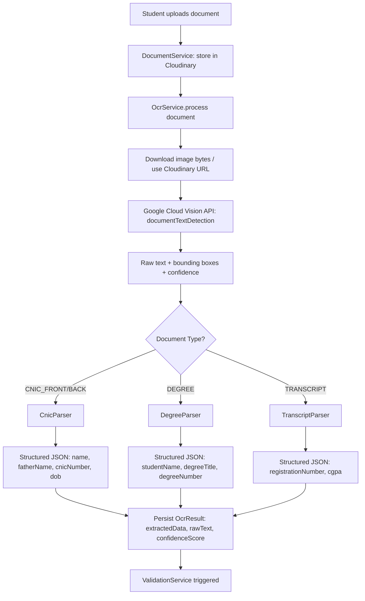
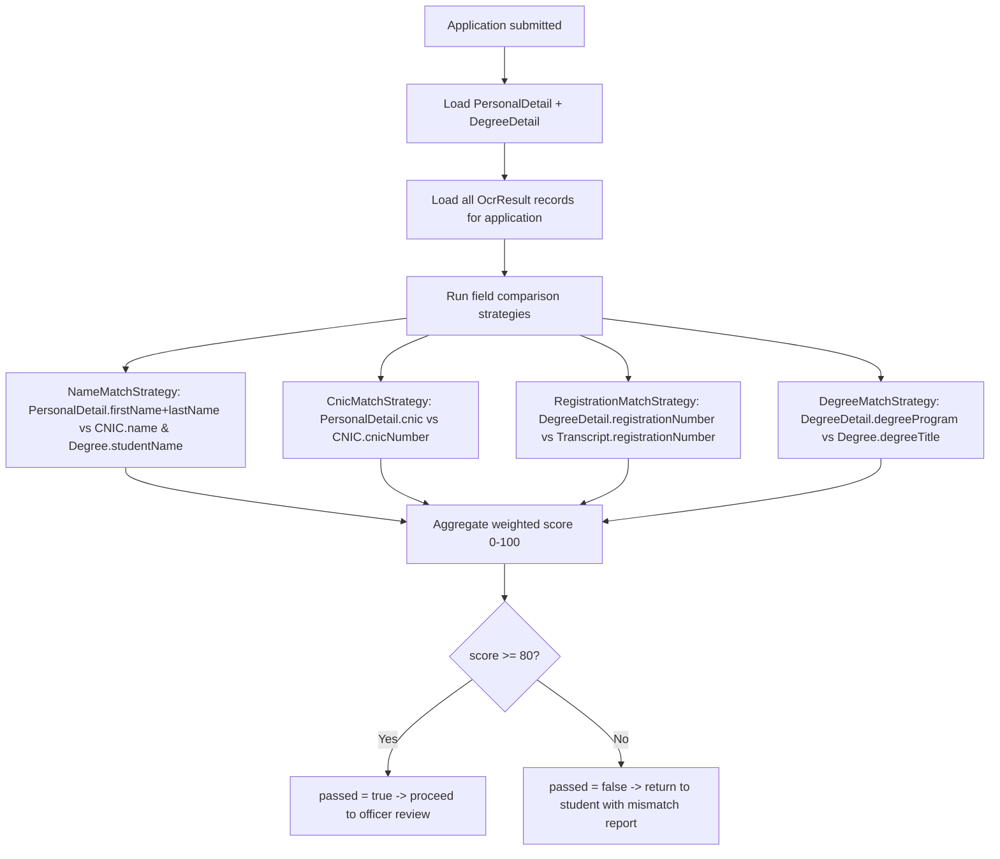

# OCR Module & Validation Module

## 1. OCR Architecture



## 2. NestJS OCR Service

```ts
// modules/ocr/vision.provider.ts
import { ImageAnnotatorClient } from '@google-cloud/vision';

export const VisionClientProvider = {
  provide: 'VISION_CLIENT',
  useFactory: (config: ConfigService) =>
    new ImageAnnotatorClient({
      keyFilename: config.get('GOOGLE_APPLICATION_CREDENTIALS'),
    }),
  inject: [ConfigService],
};

// modules/ocr/ocr.service.ts
@Injectable()
export class OcrService {
  constructor(
    @Inject('VISION_CLIENT') private vision: ImageAnnotatorClient,
    private prisma: PrismaService,
    private cnicParser: CnicParser,
    private degreeParser: DegreeParser,
    private transcriptParser: TranscriptParser,
  ) {}

  async processDocument(documentId: string) {
    const doc = await this.prisma.document.findUniqueOrThrow({ where: { id: documentId } });

    const [result] = await this.vision.textDetection(doc.cloudinaryUrl);
    const rawText = result.fullTextAnnotation?.text ?? '';
    const annotations = result.textAnnotations ?? [];

    // Average confidence across detected text blocks (Vision returns per-symbol confidence
    // for documentTextDetection; here using a simplified page-level proxy)
    const confidenceScore = this.computeConfidence(result);

    let extractedData: Record<string, any>;
    switch (doc.type) {
      case 'CNIC_FRONT':
      case 'CNIC_BACK':
        extractedData = this.cnicParser.parse(rawText);
        break;
      case 'DEGREE':
        extractedData = this.degreeParser.parse(rawText);
        break;
      case 'TRANSCRIPT':
        extractedData = this.transcriptParser.parse(rawText);
        break;
      default:
        extractedData = {};
    }

    return this.prisma.ocrResult.create({
      data: {
        documentId: doc.id,
        applicationId: doc.applicationId,
        rawText,
        extractedData,
        confidenceScore,
      },
    });
  }

  private computeConfidence(result: any): number {
    const pages = result.fullTextAnnotation?.pages ?? [];
    if (!pages.length) return 0;
    const scores = pages.flatMap((p: any) =>
      (p.blocks ?? []).map((b: any) => b.confidence ?? 0),
    );
    return scores.length ? scores.reduce((a: number, b: number) => a + b, 0) / scores.length : 0;
  }
}
```

## 3. Parsing Strategies

### 3.1 CNIC Parser

Pakistani CNIC layout is fairly structured (NADRA format). Strategy: regex over `rawText`.

```ts
// modules/ocr/parsers/cnic.parser.ts
@Injectable()
export class CnicParser {
  parse(rawText: string) {
    const cnicMatch = rawText.match(/\d{5}-\d{7}-\d{1}/);
    const dobMatch = rawText.match(/(\d{2}[.\/-]\d{2}[.\/-]\d{4})/g); // CNIC has DOB + issue/expiry dates
    const nameMatch = rawText.match(/Name\s*[:\-]?\s*([A-Z\s]+)/i);
    const fatherNameMatch = rawText.match(/Father(?:'s)? Name\s*[:\-]?\s*([A-Z\s]+)/i);

    return {
      cnicNumber: cnicMatch?.[0] ?? null,
      name: nameMatch?.[1]?.trim() ?? null,
      fatherName: fatherNameMatch?.[1]?.trim() ?? null,
      dateOfBirth: this.pickDob(dobMatch),
    };
  }

  // Heuristic: DOB is typically the earliest date on the card
  private pickDob(dates: string[] | null): string | null {
    if (!dates?.length) return null;
    const parsed = dates.map((d) => new Date(d.replace(/[.\/]/g, '-'))).filter((d) => !isNaN(d.getTime()));
    if (!parsed.length) return null;
    return parsed.sort((a, b) => a.getTime() - b.getTime())[0].toISOString().split('T')[0];
  }
}
```

### 3.2 Degree Parser

```ts
// modules/ocr/parsers/degree.parser.ts
@Injectable()
export class DegreeParser {
  parse(rawText: string) {
    const nameMatch = rawText.match(/(?:awarded to|conferred (?:upon|on))\s+([A-Z][A-Za-z\s]+)/i);
    const degreeTitleMatch = rawText.match(/(Bachelor|Master|Doctor|PhD|BS|MS|MSc|BSc|MBA)[A-Za-z\s,()]*?(?:in|of)?\s*[A-Za-z\s]*/i);
    const degreeNumberMatch = rawText.match(/(?:Degree No\.?|Certificate No\.?|Serial No\.?)\s*[:\-]?\s*([A-Z0-9\-\/]+)/i);

    return {
      studentName: nameMatch?.[1]?.trim() ?? null,
      degreeTitle: degreeTitleMatch?.[0]?.trim() ?? null,
      degreeNumber: degreeNumberMatch?.[1]?.trim() ?? null,
    };
  }
}
```

### 3.3 Transcript Parser

```ts
// modules/ocr/parsers/transcript.parser.ts
@Injectable()
export class TranscriptParser {
  parse(rawText: string) {
    const regMatch = rawText.match(/Reg(?:istration)?\.?\s*No\.?\s*[:\-]?\s*([A-Z0-9\-\/]+)/i);
    const cgpaMatch = rawText.match(/CGPA\s*[:\-]?\s*([0-4]\.\d{1,2})/i);

    return {
      registrationNumber: regMatch?.[1]?.trim() ?? null,
      cgpa: cgpaMatch ? parseFloat(cgpaMatch[1]) : null,
    };
  }
}
```

## 4. Confidence Scoring

| Score Range | Meaning | System Behavior |
|---|---|---|
| 0.90 – 1.00 | High confidence | Auto-proceed to validation |
| 0.70 – 0.89 | Medium confidence | Proceed, but flag for officer's attention in review UI |
| < 0.70 | Low confidence | Prompt student to re-upload a clearer scan before submission |

```ts
export function classifyConfidence(score: number): 'HIGH' | 'MEDIUM' | 'LOW' {
  if (score >= 0.9) return 'HIGH';
  if (score >= 0.7) return 'MEDIUM';
  return 'LOW';
}
```

## 5. Validation Module

### 5.1 Purpose
Compare data the student **typed** in the Personal/Degree Details forms against data **extracted via OCR** from uploaded CNIC, Degree, and Transcript documents. Produces a `ValidationResult` with an overall score and a field-level mismatch report.

### 5.2 Validation Flow



### 5.3 Comparison Strategies

```ts
// modules/validation/strategies/name-match.strategy.ts
import { distance } from 'fastest-levenshtein';

export function nameMatchScore(entered: string, ocrExtracted: string | null): number {
  if (!ocrExtracted) return 0;
  const a = normalize(entered);
  const b = normalize(ocrExtracted);
  const maxLen = Math.max(a.length, b.length);
  if (maxLen === 0) return 0;
  const dist = distance(a, b);
  return Math.max(0, (1 - dist / maxLen)) * 100;
}

function normalize(s: string): string {
  return s.toUpperCase().replace(/[^A-Z\s]/g, '').replace(/\s+/g, ' ').trim();
}

// modules/validation/strategies/cnic-match.strategy.ts
export function cnicMatchScore(entered: string, ocrExtracted: string | null): number {
  if (!ocrExtracted) return 0;
  return entered.replace(/-/g, '') === ocrExtracted.replace(/-/g, '') ? 100 : 0;
}

// exact-match style strategy reused for registrationNumber & degreeTitle
export function exactOrFuzzyMatch(entered: string, ocrExtracted: string | null, fuzzy = true): number {
  if (!ocrExtracted) return 0;
  if (entered.trim().toUpperCase() === ocrExtracted.trim().toUpperCase()) return 100;
  return fuzzy ? nameMatchScore(entered, ocrExtracted) : 0;
}
```

### 5.4 Validation Service

```ts
// modules/validation/validation.service.ts
const WEIGHTS = {
  name: 0.35,
  cnic: 0.25,
  registrationNumber: 0.2,
  degreeTitle: 0.2,
};
const PASS_THRESHOLD = 80;

@Injectable()
export class ValidationService {
  constructor(private prisma: PrismaService) {}

  async validate(applicationId: string) {
    const application = await this.prisma.application.findUniqueOrThrow({
      where: { id: applicationId },
      include: {
        student: { include: { personalDetail: true } },
        degreeDetail: true,
        documents: { include: { ocrResult: true } },
      },
    });

    const personal = application.student.personalDetail!;
    const degree = application.degreeDetail!;

    const cnicOcr = this.findExtracted(application.documents, ['CNIC_FRONT', 'CNIC_BACK']);
    const degreeOcr = this.findExtracted(application.documents, ['DEGREE']);
    const transcriptOcr = this.findExtracted(application.documents, ['TRANSCRIPT']);

    const enteredFullName = `${personal.firstName} ${personal.lastName}`;

    const scores = {
      name: Math.max(
        nameMatchScore(enteredFullName, cnicOcr?.name),
        nameMatchScore(enteredFullName, degreeOcr?.studentName),
      ),
      cnic: cnicMatchScore(personal.cnic, cnicOcr?.cnicNumber),
      registrationNumber: exactOrFuzzyMatch(degree.registrationNumber, transcriptOcr?.registrationNumber),
      degreeTitle: exactOrFuzzyMatch(degree.degreeProgram, degreeOcr?.degreeTitle, true),
    };

    const overallScore =
      scores.name * WEIGHTS.name +
      scores.cnic * WEIGHTS.cnic +
      scores.registrationNumber * WEIGHTS.registrationNumber +
      scores.degreeTitle * WEIGHTS.degreeTitle;

    const mismatchReport = Object.entries(scores)
      .filter(([, v]) => v < 70)
      .map(([field, score]) => ({ field, score, severity: score < 40 ? 'HIGH' : 'MEDIUM' }));

    return this.prisma.validationResult.upsert({
      where: { applicationId },
      create: {
        applicationId,
        overallScore,
        passed: overallScore >= PASS_THRESHOLD,
        mismatchReport,
      },
      update: { overallScore, passed: overallScore >= PASS_THRESHOLD, mismatchReport },
    });
  }

  private findExtracted(documents: any[], types: string[]) {
    const doc = documents.find((d) => types.includes(d.type) && d.ocrResult);
    return doc?.ocrResult?.extractedData ?? null;
  }
}
```

### 5.5 Mismatch Report Example (stored as JSON)

```json
[
  { "field": "cnic", "score": 0, "severity": "HIGH" },
  { "field": "degreeTitle", "score": 62, "severity": "MEDIUM" }
]
```

### 5.6 UI Implication
The Officer Review screen ([04-frontend-nextjs.md](04-frontend-nextjs.md)) renders a side-by-side diff table: **Entered Value | OCR Extracted Value | Match Score | Status icon (✅/⚠️/❌)**, allowing manual override (officer can approve despite a flagged mismatch with a justification note, logged to `AuditLog`).
