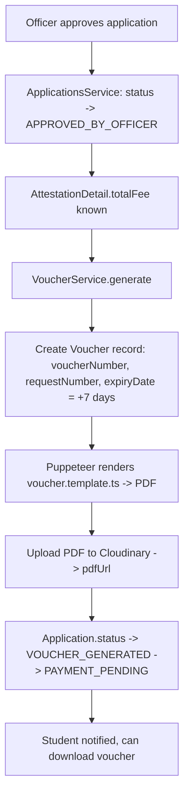
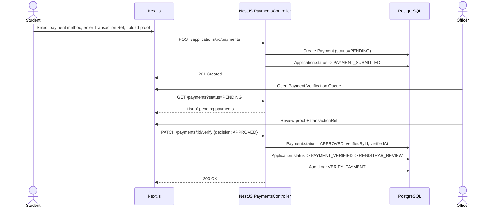

# Voucher, Payment, Degree Generation, QR, Verification Portal & Audit Log

## 1. Voucher Module

### 1.1 Flow



### 1.2 Voucher Numbering

```ts
// voucherNumber format: VCH-<YEAR>-<6-digit-sequence>
// requestNumber == application.applicationNumber (1:1 reference)
export function generateVoucherNumber(sequence: number): string {
  const year = new Date().getFullYear();
  return `VCH-${year}-${String(sequence).padStart(6, '0')}`;
}
```

### 1.3 VoucherService

```ts
@Injectable()
export class VouchersService {
  constructor(private prisma: PrismaService, private pdf: PdfService, private cloudinary: CloudinaryService) {}

  async generate(applicationId: string) {
    const app = await this.prisma.application.findUniqueOrThrow({
      where: { id: applicationId },
      include: { attestationDetail: true, student: { include: { personalDetail: true } } },
    });

    const sequence = await this.nextSequence();
    const voucherNumber = generateVoucherNumber(sequence);
    const expiryDate = addDays(new Date(), 7);

    const voucher = await this.prisma.voucher.create({
      data: {
        applicationId,
        voucherNumber,
        requestNumber: app.applicationNumber,
        studentName: `${app.student.personalDetail!.firstName} ${app.student.personalDetail!.lastName}`,
        serviceType: app.attestationDetail!.type,
        amount: app.attestationDetail!.totalFee,
        expiryDate,
      },
    });

    const pdfBuffer = await this.pdf.render('voucher', { voucher, application: app });
    const { url } = await this.cloudinary.uploadBuffer(pdfBuffer, `vouchers/${voucherNumber}.pdf`);

    const updated = await this.prisma.voucher.update({ where: { id: voucher.id }, data: { pdfUrl: url } });
    await this.prisma.application.update({ where: { id: applicationId }, data: { status: 'PAYMENT_PENDING' } });
    return updated;
  }
}
```

### 1.4 Database Schema
See `Voucher` model in [02-database-erd-prisma.md](02-database-erd-prisma.md).

---

## 2. Payment Module

### 2.1 Database Design
See `Payment` model in [02-database-erd-prisma.md](02-database-erd-prisma.md). Key fields: `method` (BANK_CHALLAN | EASYPAISA | JAZZCASH), `status` (PENDING | APPROVED | REJECTED), `transactionRef`, `proofUrl`.

### 2.2 Payment Submission & Verification Workflow



### 2.3 Payment Method Specifics

| Method | `transactionRef` meaning | Proof required |
|---|---|---|
| BANK_CHALLAN | Bank deposit slip number | Yes — scanned challan image |
| EASYPAISA | EasyPaisa Transaction ID (TID) | Optional — screenshot recommended |
| JAZZCASH | JazzCash Transaction ID (TID) | Optional — screenshot recommended |

> **Academic-project note:** Since real payment gateway integration (1Link, JazzCash API, EasyPaisa API) requires merchant accounts not available to students, the system uses a **manual verification model**: student submits proof/reference, an Officer/Admin cross-checks against bank statements and manually approves. This mirrors many real HEC-style portals for institutions without direct gateway integration. A "Future Work" note in the roadmap suggests real gateway integration as an extension.

### 2.4 API Recap
See section 2.11 in [03-backend-nestjs.md](03-backend-nestjs.md).

---

## 3. Degree Generation Module (PDF via Puppeteer)

### 3.1 Service Flow

```mermaid
flowchart TD
    A[Registrar clicks Generate Certificate] --> B[CertificatesController.generate]
    B --> C{Determine template by AttestationType}
    C -->|DEGREE_GENERATION / DUPLICATE_DEGREE| D[degree.template.ts]
    C -->|TRANSCRIPT_ATTESTATION| E[transcript.template.ts]
    C -->|DEGREE_ATTESTATION| F[attestation.template.ts]
    D & E & F --> G[Render HTML with application data via templating]
    G --> H[Puppeteer launches headless Chromium]
    H --> I[page.setContent(html) -> page.pdf]
    I --> J[Compute SHA-256 of PDF buffer]
    J --> K[Upload PDF to Cloudinary]
    K --> L[Create GeneratedCertificate record: pdfUrl, sha256Hash]
    L --> M[Application.status -> CERTIFICATE_GENERATED]
    M --> N[Trigger BlockchainModule.registerDegree]
```

### 3.2 PdfService (Puppeteer Provider)

```ts
// modules/certificates/pdf/puppeteer.provider.ts
@Injectable()
export class PdfService {
  async render(templateName: 'degree' | 'transcript' | 'attestation' | 'voucher', data: any): Promise<Buffer> {
    const html = renderTemplate(templateName, data); // returns HTML string via template fn

    const browser = await puppeteer.launch({ headless: true, args: ['--no-sandbox'] });
    try {
      const page = await browser.newPage();
      await page.setContent(html, { waitUntil: 'networkidle0' });
      const pdf = await page.pdf({ format: 'A4', printBackground: true, margin: { top: '20mm', bottom: '20mm', left: '15mm', right: '15mm' } });
      return Buffer.from(pdf);
    } finally {
      await browser.close();
    }
  }
}
```

### 3.3 Degree Template (excerpt)

```ts
// modules/certificates/pdf/templates/degree.template.ts
export function degreeTemplate(data: DegreeTemplateData): string {
  return /* html */ `
  <html>
    <head>
      <style>
        body { font-family: 'Georgia', serif; text-align: center; padding: 60px; border: 10px double #1a3c6e; }
        h1 { font-size: 32px; color: #1a3c6e; }
        .name { font-size: 28px; font-weight: bold; margin: 20px 0; }
        .degree-id { position: absolute; bottom: 30px; right: 40px; font-size: 10px; }
        .qr { position: absolute; bottom: 30px; left: 40px; }
      </style>
    </head>
    <body>
      <h1>${data.universityName}</h1>
      <p>This is to certify that</p>
      <div class="name">${data.studentName}</div>
      <p>has been awarded the degree of</p>
      <h2>${data.degreeProgram}</h2>
      <p>in the Department of ${data.department}, having passed in ${data.passingYear}
         with a CGPA of ${data.cgpa}.</p>
      <p>Registration No: ${data.registrationNumber}</p>
      <div class="degree-id">Degree ID: ${data.degreeId}</div>
    </body>
  </html>`;
}
```

### 3.4 Database Design
See `GeneratedCertificate` model in [02-database-erd-prisma.md](02-database-erd-prisma.md). `sha256Hash` is the value passed to the smart contract's `registerDegree()`.

---

## 4. QR Module

### 4.1 QR Payload Design

The QR encodes a JSON payload (or a direct verification URL — recommended for simplicity and offline scanning by any QR app):

```json
{
  "url": "https://attestation.university.edu/verify/DAS-2026-000123",
  "degreeId": "DAS-2026-000123",
  "txHash": "0xabc123...",
  "sha256": "f3a1c9..."
}
```

Recommended: encode just the **verification URL** (`https://.../verify/DAS-2026-000123`) so any phone camera resolves it directly to the public verification page, which then internally fetches `txHash` and `sha256` for display.

### 4.2 QrService

```ts
// modules/qr/qr.service.ts
import * as QRCode from 'qrcode';

@Injectable()
export class QrService {
  constructor(private prisma: PrismaService, private cloudinary: CloudinaryService, private config: ConfigService) {}

  async generate(applicationId: string) {
    const record = await this.prisma.blockchainRecord.findUniqueOrThrow({ where: { applicationId } });
    const verifyUrl = `${this.config.get('PUBLIC_VERIFY_BASE_URL')}/verify/${record.degreeId}`;

    const qrBuffer = await QRCode.toBuffer(verifyUrl, { type: 'png', width: 400, margin: 1 });
    const { url } = await this.cloudinary.uploadBuffer(qrBuffer, `qr/${record.degreeId}.png`);

    return this.prisma.blockchainRecord.update({
      where: { applicationId },
      data: { qrCodeUrl: url },
    });
  }
}
```

### 4.3 Architecture & API
- Triggered automatically after `BLOCKCHAIN_REGISTERED` status (event-driven, e.g., via `EventEmitter2` listening for `degree.registered`).
- `GET /applications/:id/qr` → `{ qrCodeUrl, verifyUrl, degreeId }`.
- QR image embedded into the final certificate PDF (re-render with `qr` field populated) OR shown as a separate downloadable image alongside the certificate — recommended: **re-generate certificate PDF once with QR embedded** as the final artifact shown to students.

---

## 5. Public Verification Portal

### 5.1 Verification Methods & Responses

| Method | Endpoint | Input | Output |
|---|---|---|---|
| Degree ID | `GET /verify/degree-id/:degreeId` | `DAS-2026-000123` | Student name, degree, university, status, issue date, blockchain status |
| QR Scan | `POST /verify/qr` | Scanned URL/payload | Parses `degreeId` from URL, same as above |
| CNIC | `POST /verify/cnic` | CNIC number | List of degrees associated (masked names if multiple) |

### 5.2 Verification Flow

```mermaid
flowchart TD
    A[External Verifier opens /verify] --> B{Choose method}
    B -->|Degree ID| C[GET /verify/degree-id/:id]
    B -->|QR| D[Scan QR -> extract degreeId from URL]
    B -->|CNIC| E[POST /verify/cnic]
    C & D & E --> F[VerificationService.lookup]
    F --> G[Find Application by degreeId/CNIC]
    G --> H[Find BlockchainRecord]
    H --> I[Call contract.verifyDegree(degreeId) - on-chain read]
    I --> J{found && status == Registered?}
    J -->|Yes| K[Return: name, degree, university, issueDate, status=VALID, txHash]
    J -->|No / Revoked| L[Return: status=INVALID/REVOKED]
    K & L --> M[Log VerificationRequest record]
    M --> N[Render VerificationResultCard]
```

### 5.3 VerificationService

```ts
@Injectable()
export class VerificationService {
  constructor(private prisma: PrismaService, private blockchain: BlockchainService) {}

  async verifyByDegreeId(degreeId: string, ip: string) {
    const record = await this.prisma.blockchainRecord.findUnique({
      where: { degreeId },
      include: { application: { include: { student: { include: { personalDetail: true } }, degreeDetail: true } } },
    });

    if (!record) {
      await this.logRequest(null, degreeId, 'DEGREE_ID', false, ip);
      return { found: false };
    }

    const onChain = await this.blockchain.verifyDegree(degreeId);

    await this.logRequest(record.id, degreeId, 'DEGREE_ID', true, ip);

    return {
      found: true,
      status: onChain.status, // 'Registered' | 'Revoked' | 'NotRegistered'
      studentName: `${record.application.student.personalDetail!.firstName} ${record.application.student.personalDetail!.lastName}`,
      degreeProgram: record.application.degreeDetail!.degreeProgram,
      university: record.application.degreeDetail!.university,
      issueDate: record.registeredAt,
      txHash: record.txHash,
      sha256Hash: onChain.sha256Hash,
    };
  }

  private async logRequest(blockchainRecordId: string | null, degreeIdQueried: string, method: string, found: boolean, ip: string) {
    return this.prisma.verificationRequest.create({
      data: { blockchainRecordId, degreeIdQueried, method, found, verifierIp: ip },
    });
  }
}
```

### 5.4 UI Design
See section 5 in [04-frontend-nextjs.md](04-frontend-nextjs.md) — tabbed interface (Degree ID / CNIC / QR Scan), result rendered as a verification card with a green "✅ Verified on Blockchain" badge or red "❌ Not Found / Revoked" badge, plus a link to view the transaction on Polygon Amoy explorer (`https://amoy.polygonscan.com/tx/{txHash}`).

### 5.5 Rate Limiting
`/verify/*` endpoints throttled (e.g., 10 requests/minute/IP) to prevent CNIC enumeration attacks — `@nestjs/throttler` applied at controller level.

---

## 6. Audit Log Module

### 6.1 Tracked Actions
`LOGIN`, `LOGOUT`, `REGISTER`, `UPLOAD_DOCUMENT`, `SUBMIT_APPLICATION`, `APPROVE_APPLICATION`, `REJECT_APPLICATION`, `VERIFY_PAYMENT`, `GENERATE_CERTIFICATE`, `BLOCKCHAIN_REGISTER`, `BLOCKCHAIN_REVOKE`, `VERIFICATION_REQUEST`.

### 6.2 Database Schema
See `AuditLog` model in [02-database-erd-prisma.md](02-database-erd-prisma.md).

### 6.3 AuditLogService

```ts
@Injectable()
export class AuditLogService {
  constructor(private prisma: PrismaService) {}

  log(userId: string | null, action: AuditAction, metadata?: Record<string, any>, req?: Request) {
    return this.prisma.auditLog.create({
      data: {
        userId,
        action,
        metadata,
        ipAddress: req?.ip,
        userAgent: req?.headers['user-agent'],
      },
    });
  }
}
```

### 6.4 Interceptor-Based Auto-Logging (optional pattern)

```ts
// common/interceptors/audit-log.interceptor.ts
@Injectable()
export class AuditLogInterceptor implements NestInterceptor {
  constructor(private auditLog: AuditLogService) {}

  intercept(context: ExecutionContext, next: CallHandler) {
    const req = context.switchToHttp().getRequest();
    const action = this.reflector?.get('auditAction', context.getHandler());
    return next.handle().pipe(
      tap(() => {
        if (action) this.auditLog.log(req.user?.id ?? null, action, { path: req.path, params: req.params }, req);
      }),
    );
  }
}
```

### 6.5 API Recap
See section 2.16 in [03-backend-nestjs.md](03-backend-nestjs.md). Admin dashboard provides filterable, paginated audit log viewer with CSV export for academic reporting/demo purposes.
