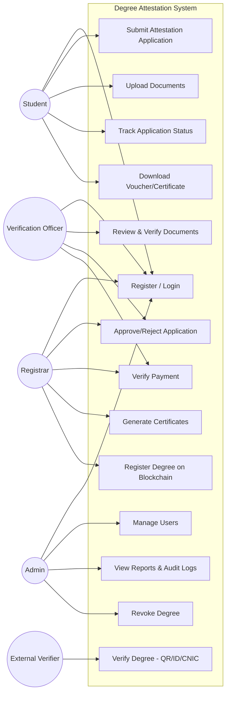
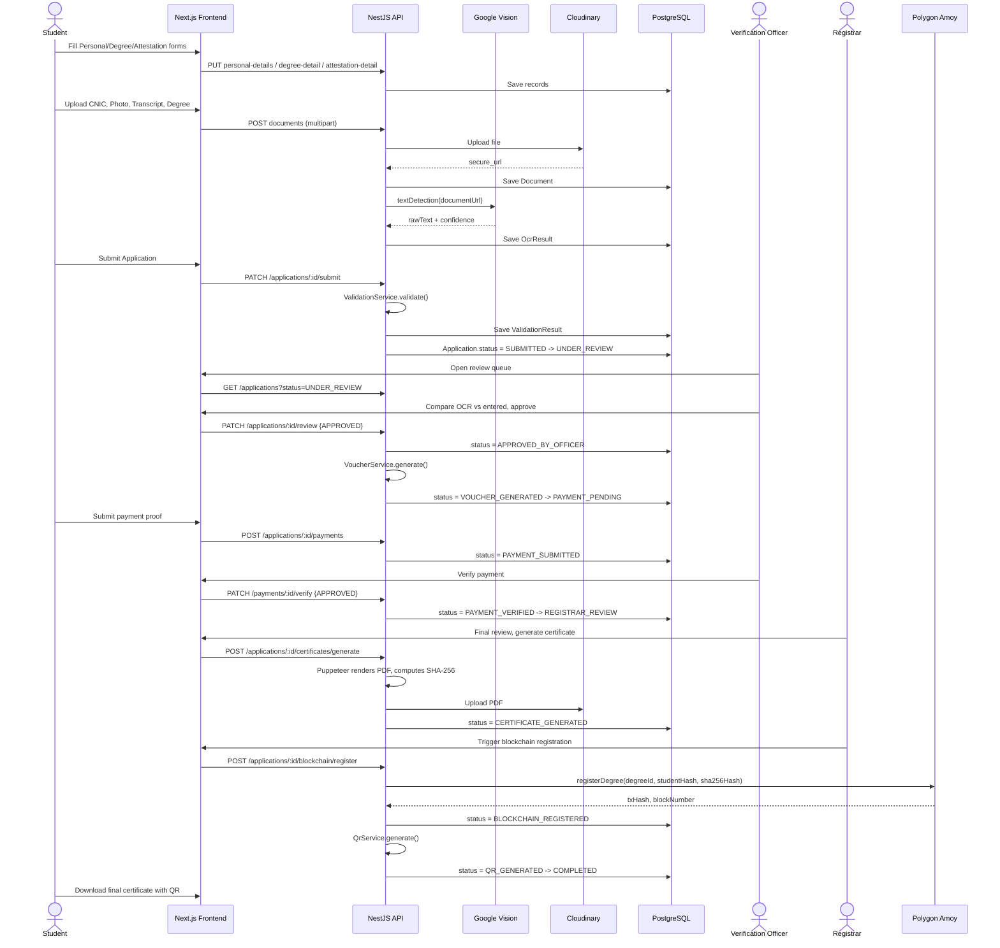
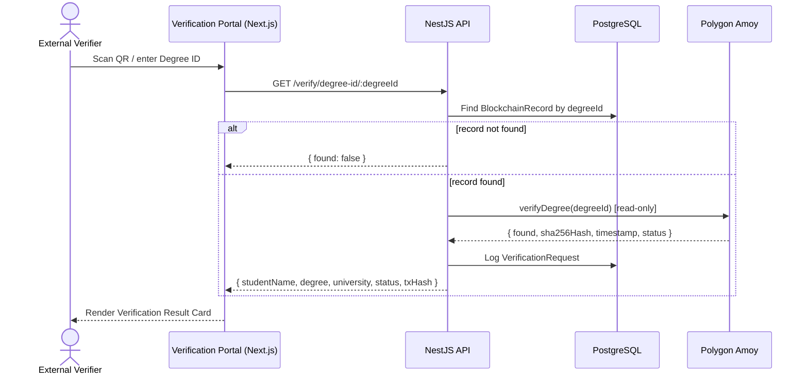
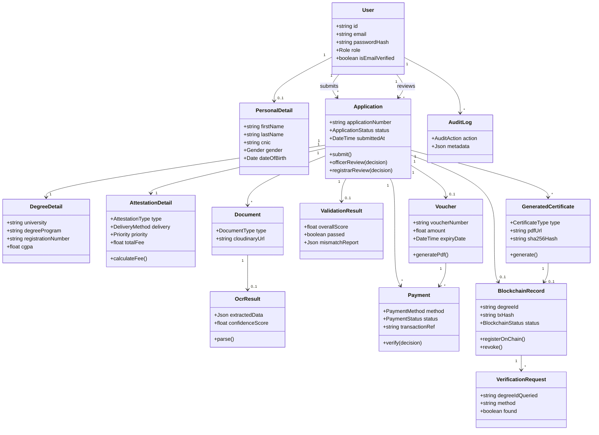
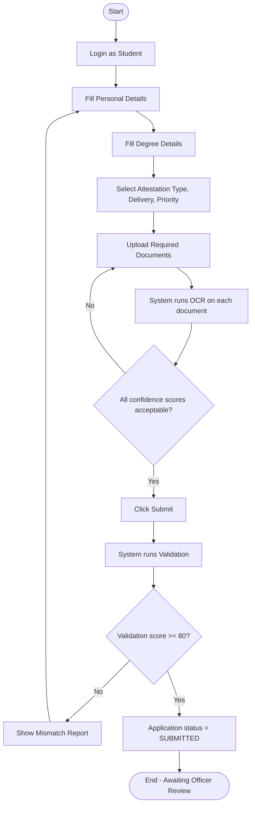
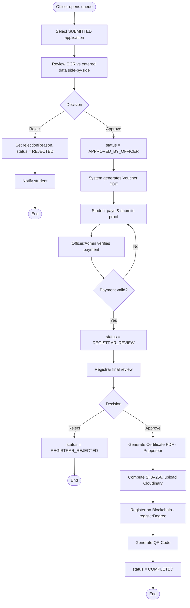
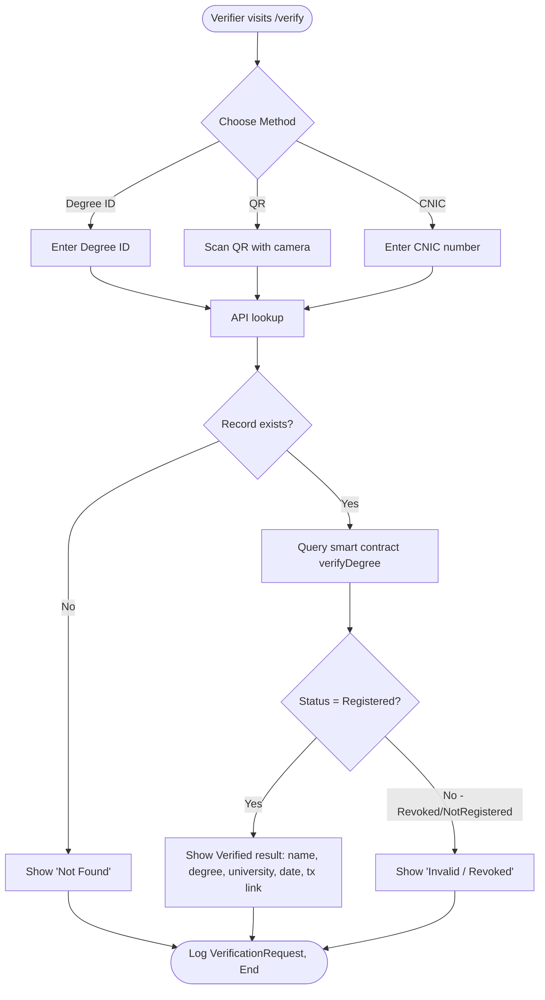

# Sequence, Use Case, Class & Activity Diagrams

## 1. Use Case Diagram

## 2. Sequence Diagram — Full Application Lifecycle

## 3. Sequence Diagram — Public Verification

## 4. Class Diagram (Backend Domain Model)

## 5. Activity Diagram — Student Application Submission

## 6. Activity Diagram — Officer & Registrar Processing

## 7. Activity Diagram — Public Verification

