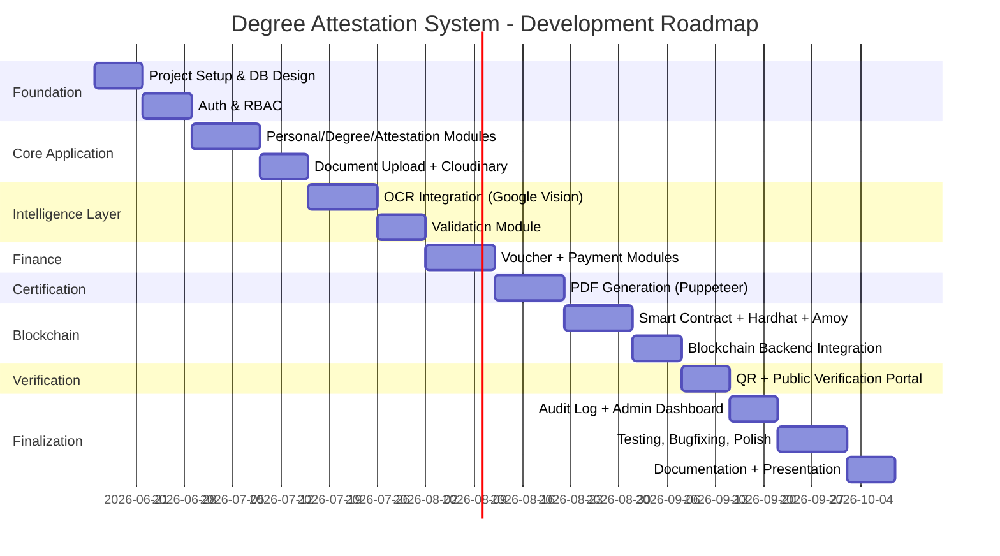

# Development Roadmap, Sprint Plan & Final Presentation Structure

## 1. Development Roadmap (High-Level Phases)

Total estimated duration: **~16 weeks** (suitable for a 1-semester / Final Year Project timeline).

## 2. Sprint Plan (2-Week Sprints)

### Sprint 1 — Foundation
- Set up monorepo or separate `frontend`/`backend`/`blockchain` repos
- PostgreSQL setup, Prisma schema (full, as designed), initial migration
- NestJS project scaffold: config module, Prisma module, global exception filter
- Next.js project scaffold: Tailwind, Shadcn init, base layout
- **Deliverable**: Running skeleton apps, DB connected, Swagger live

### Sprint 2 — Authentication & RBAC
- Register/login/JWT (access + refresh), email verification, password reset
- Roles guard, RolesGuard, role-seeded users (Admin, Officer, Registrar)
- Frontend: login/register pages, auth store, middleware route protection
- **Deliverable**: Full auth flow working end-to-end for all 4 roles

### Sprint 3 — Personal & Degree Details
- PersonalDetail + DegreeDetail CRUD APIs and DTOs
- Frontend wizard steps 1-2 with RHF + Zod
- **Deliverable**: Student can fill and persist personal/degree details

### Sprint 4 — Attestation & Document Upload
- AttestationDetail module + fee calculator
- Cloudinary signed upload integration, Document CRUD
- Frontend: attestation type selector with live fee preview, document upload step
- **Deliverable**: Student can complete full intake form + upload all 5 documents

### Sprint 5 — OCR Module
- Google Vision integration, CNIC/Degree/Transcript parsers
- Confidence scoring, OcrResult persistence
- **Deliverable**: Uploaded documents auto-produce structured OCR JSON

### Sprint 6 — Validation Module
- Comparison strategies (name, CNIC, registration no., degree title)
- Weighted scoring, mismatch report
- Frontend: validation report UI, officer diff view
- **Deliverable**: Submit button blocked/warned based on validation score

### Sprint 7 — Voucher & Payment
- Voucher generation (PDF via Puppeteer), numbering scheme
- Payment submission + manual verification workflow
- Frontend: voucher download, payment form, officer verification queue
- **Deliverable**: End-to-end fee → voucher → payment → verification

### Sprint 8 — Certificate Generation (Puppeteer)
- Degree/Transcript/Attestation HTML templates
- PDF rendering service, SHA-256 hashing, Cloudinary upload
- **Deliverable**: Registrar can generate downloadable certificates

### Sprint 9 — Blockchain Integration
- Write, test, deploy `DegreeAttestation.sol` to Amoy
- BlockchainService (ethers.js): registerDegree, verifyDegree, revokeDegree
- Frontend: registrar "Register on Blockchain" action + status display
- **Deliverable**: Certificate hash stored on Polygon Amoy, visible on Polygonscan

### Sprint 10 — QR & Public Verification Portal
- QR generation, embed in final certificate
- Public `/verify` portal (Degree ID / CNIC / QR scan)
- VerificationRequest logging
- **Deliverable**: Anyone can verify a degree publicly without login

### Sprint 11 — Audit Log & Admin Dashboard
- AuditLog service + interceptor wiring across modules
- Admin: user management, application oversight, reports, audit log viewer
- **Deliverable**: Full admin oversight capability

### Sprint 12 — Testing, Hardening & Demo Prep
- E2E tests (critical paths), security pass (rate limiting, helmet, CORS)
- Seed data for demo (sample students, applications at various stages)
- Deployment to staging (Vercel + Render/Railway + Amoy)
- Final documentation, presentation deck, demo script

## 3. Risk & Mitigation Notes

| Risk | Mitigation |
|---|---|
| Google Vision OCR accuracy on low-quality scans | Confidence threshold + manual officer override; allow re-upload |
| Polygon Amoy testnet instability/faucet limits | Cache contract calls; keep a local Hardhat fallback for demo |
| Real payment gateways unavailable to students | Manual verification model (documented as intentional design choice) |
| Time overrun on blockchain integration | Build and test contract early (Sprint 9 scheduled mid-project with buffer in Sprint 12) |

## 4. Final Project Presentation Structure

1. **Title Slide** — Project name, team, supervisor, university
2. **Problem Statement** — Manual, paper-based degree attestation: slow, fraud-prone, no central verification
3. **Proposed Solution Overview** — Paperless, OCR-assisted, blockchain-anchored attestation (1 slide system diagram)
4. **Objectives** — Bullet list mapped to module list
5. **Technology Stack** — Stack table (from [00-overview.md](00-overview.md))
6. **System Architecture** — High-level architecture diagram
7. **Database Design** — ERD (simplified view)
8. **User Roles & Workflow** — Role table + end-to-end flowchart
9. **Key Module Demos** (each as its own slide with screenshot):
   - Student application wizard
   - OCR extraction result
   - Validation report / officer review
   - Voucher & payment
   - Certificate generation
   - Blockchain registration (Polygonscan tx)
   - QR code & public verification
10. **Smart Contract Overview** — Contract functions, Amoy deployment address
11. **Security Measures** — JWT, RBAC, encryption, rate limiting
12. **Live Demo** — End-to-end walkthrough (student submits → admin/registrar processes → public verifies)
13. **Challenges Faced & Solutions**
14. **Future Enhancements**:
    - Real payment gateway integration (JazzCash/EasyPaisa APIs)
    - Mobile app for verification
    - Multi-university support (multi-tenant)
    - AI-based document forgery detection
    - Mainnet deployment
15. **Conclusion**
16. **Q&A**

## 5. Demo Script (Suggested Order)

1. Register a new student account, verify email (show inbox)
2. Complete the 5-step application wizard, upload sample documents
3. Show OCR results populating automatically
4. Show validation score and mismatch report
5. Switch to Officer account → review application → approve
6. Show voucher PDF generated, download
7. Switch back to Student → submit payment proof
8. Switch to Officer/Admin → verify payment
9. Switch to Registrar → generate certificate PDF → register on blockchain
10. Show transaction on Polygon Amoy explorer (Polygonscan)
11. Open public `/verify` portal in incognito → search by Degree ID and by scanning the QR on the generated certificate
12. Show Admin dashboard: users, applications, audit logs
